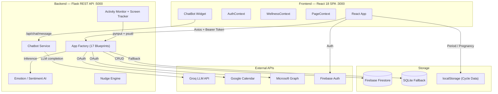

<p align="center">
  <h1 align="center">Infinite Helix</h1>
  <p align="center">
    <strong>AI-Powered Micro-Wellness & Productivity Assistant for Women Employees</strong>
  </p>
</p>

<p align="center">
  
  
  
  
  
  
  
</p>

<p align="center">
  A background AI assistant that helps women employees manage work, emotions, energy, and mental well-being through <strong>context-aware wellness nudges</strong>, <strong>emotion AI</strong>, <strong>an LLM-powered chatbot</strong>, and <strong>optional cycle-aware insights</strong> — all with a beautiful dark-first UI.
</p>

---

## Why Infinite Helix?

- **Supportive, not surveillance** — nudges feel caring, never intrusive. Hydration, stretch, eye rest, and breathing reminders arrive at the right moment based on real activity data.
- **Emotion AI built in** — journal entries are instantly analyzed for emotion (7 classes) and sentiment with supportive reframing for stress.
- **Privacy-first cycle tracking** — optional menstrual phase and pregnancy tracking stored *exclusively* in `localStorage`. Never sent to any server.
- **Groq-powered AI chatbot** — "Helix" is page-context-aware, knows your wellness score, calendar, tasks, and cycle phase. Falls back to templates when offline.
- **Zero-config demo mode** — works immediately without Firebase, Groq keys, or ML model downloads. One command to start.

---

## Features

| Feature | Description |
|---------|-------------|
| **Work Behavior Tracking** | Keyboard/mouse activity, idle detection, continuous work monitoring via `pynput` + `psutil` |
| **Context-Aware Nudges** | Smart reminders — hydration, stretch, eye rest, breathing — with cooldown and priority logic |
| **Emotion & Sentiment AI** | HuggingFace DistilRoBERTa (emotion, 7 classes) + RoBERTa (sentiment) with supportive reframing |
| **AI Chatbot ("Helix")** | Groq LLM (`llama-3.3-70b-versatile`) with page-context awareness, memory, emotional trajectory, quick replies |
| **Cycle Energy Mode** | Optional menstrual phase logging — adjusts nudges based on energy levels across 4 phases (28-day model) |
| **Motherhood Shield** | Pregnancy mode with trimester tracking, appointment countdown, and adapted breathing exercises |
| **Pre-Meeting Calm** | Google Calendar + Microsoft Graph integration — breathing/confidence exercises before meetings |
| **Dashboard** | Real-time wellness score (0-100), screen time donut, break balance, hydration tracker, focus timeline |
| **Reports & Analytics** | Weekly report card, stress heatmap, emotion chart, digital body language analysis, printable HTML/PDF |
| **Emotion Journal** | Write entries, get instant AI emotion analysis with confidence scores and reframing |
| **Todo Management** | Tasks with categories (work/personal/health/meeting), reminders, date navigation, overdue tracking |
| **Stress Detection** | Standalone typing-pattern monitor, real-time stress level polling, guided breathing intervention |
| **Multi-Channel Notifications** | Desktop toasts (`plyer`) + browser Web Notifications API + in-app overlay |
| **Self-Care Tracking** | Log stretches and eye rest breaks with daily counts and weekly trends |
| **Authentication** | Firebase Auth — email/password + Google OAuth 2.0 (demo mode works without Firebase) |

---

## Tech Stack

| Layer | Technology |
|-------|------------|
| **Frontend** | React 18, Tailwind CSS 3.4, Chart.js, React Router 6, Framer Motion, react-hot-toast, react-icons |
| **Backend** | Python Flask 3, Flask-CORS |
| **AI / ML** | HuggingFace Transformers (DistilRoBERTa, RoBERTa) — keyword mock in demo mode |
| **LLM Chatbot** | Groq API (`llama-3.3-70b-versatile`) — template fallback without key |
| **Database** | Firebase Firestore (primary) / SQLite LocalStore (automatic fallback) |
| **Auth** | Firebase Authentication (email + Google OAuth 2.0) |
| **Tracking** | psutil (screen/process), pynput (keyboard/mouse) |
| **Calendar** | Google Calendar API v3, Microsoft Graph API |
| **Notifications** | plyer (desktop), Web Notifications API (browser) |
| **Design** | Dark-first bento-grid layout, CSS custom properties, Plus Jakarta Sans |

---

## Architecture



### Folder Structure

```
Infinite_helix/
├── backend/                         Python Flask REST API
│   ├── run.py                       Entry point + background tracker thread
│   ├── stress_agent.py              Standalone typing-pattern stress detector
│   ├── config/settings.py           Environment-based config (26 settings)
│   ├── app/
│   │   ├── __init__.py              App factory, 17 blueprints, AI model init
│   │   ├── routes/                  17 API blueprints (~35 endpoints)
│   │   ├── services/                Firebase, Calendar, Chatbot, Reports, Settings
│   │   ├── ai/                      Emotion, Sentiment, Nudge Engine, Wellness Advisor
│   │   ├── tracker/                 Activity Monitor, Screen Tracker
│   │   ├── notifications/           Desktop toasts (plyer)
│   │   └── models/                  Firestore document schemas
│   └── data/                        SQLite local.db (auto-created, gitignored)
│
├── frontend/                        React 18 + Tailwind CSS SPA
│   └── src/
│       ├── pages/                   8 pages: Dashboard, Todos, Reports, CycleMode, Calendar, Settings, Auth, Journal
│       ├── components/              20+ components (Dashboard, Reports, CycleMode, ChatBot, Common, Journal, Settings)
│       ├── context/                 AuthContext, WellnessContext, PageContext, ThemeContext
│       ├── hooks/                   useStressDetector, useBreakReminder, usePeriodTracker, usePregnancyMode, ...
│       ├── services/                api.js, firebase.js, notifications, meal/todo/privateCare/eyeRest reminders
│       └── utils/                   periodMath.js
│
├── docs/                            Product docs, architecture, API docs, pitch
└── prototype/                       Static HTML prototype
```

---

## Quick Start

### Prerequisites

- **Python** 3.10+
- **Node.js** 18+ and npm

### Option 1: Demo Mode (Zero Config)

```bash
# 1. Clone
git clone https://github.com/YOUR_USERNAME/AI-Powered-Micro-Wellness-Productivity-Assistant-for-Women-Employees.git
cd AI-Powered-Micro-Wellness-Productivity-Assistant-for-Women-Employees

# 2. Backend (Terminal 1)
cd Infinite_helix/backend
python setup_demo.py          # Creates .env, installs deps
python run.py                 # Flask API on http://localhost:5000

# 3. Frontend (Terminal 2)
cd Infinite_helix/frontend
npm install
npm run dev                   # React app on http://localhost:3000
```

Open **http://localhost:3000** — register with any email/password to start.

### Option 2: Full Mode (Firebase + AI Models)

1. **Firebase** — Create a project at [console.firebase.google.com](https://console.firebase.google.com), enable Auth (Email + Google) and Firestore. Download the service account JSON to `backend/config/firebase-credentials.json`. Copy the web config to `frontend/.env`.

2. **Groq** — Get an API key from [console.groq.com](https://console.groq.com) and add `GROQ_API_KEY=` to `backend/.env`.

3. **Calendar** *(optional)* — Set up Google OAuth and/or Microsoft Azure AD credentials in `backend/.env`.

4. Set `DEMO_MODE=false` in `backend/.env`, then start backend and frontend as above.

### Option 3: Stress Agent (Optional)

```bash
cd Infinite_helix/backend
python stress_agent.py        # Monitors typing patterns, posts to Flask API
```

---

## API Reference

All endpoints are under `/api/`. Authentication is via Firebase ID token as `Bearer` in the `Authorization` header.

| Method | Endpoint | Purpose |
|--------|----------|---------|
| `GET` | `/api/health` | Health check + demo mode status |
| | | |
| `POST` | `/api/auth/register` | Register new user |
| `POST` | `/api/auth/sync` | Sync profile on login |
| `GET` | `/api/auth/profile` | Get user profile |
| | | |
| `GET` | `/api/dashboard/today` | Live dashboard metrics (score, screen time, activity, hydration, breaks) |
| `GET` | `/api/dashboard/screen-history` | Screen time history (N days) |
| | | |
| `POST` | `/api/journal` | Create journal entry with AI emotion/sentiment analysis |
| `GET` | `/api/journal` | List journal entries |
| `GET` | `/api/journal/:id` | Get specific entry |
| | | |
| `POST` | `/api/emotion/analyze` | Standalone emotion detection |
| `POST` | `/api/sentiment/analyze` | Standalone sentiment analysis |
| | | |
| `GET` | `/api/tracker/status` | Real-time activity + screen stats |
| `POST` | `/api/tracker/start` | Start activity monitor |
| `POST` | `/api/tracker/stop` | Stop activity monitor |
| | | |
| `POST` | `/api/nudge/generate` | Generate context-aware nudge |
| `GET` | `/api/nudge/pending` | Get pending nudges |
| `POST` | `/api/nudge/:id/dismiss` | Dismiss a nudge |
| | | |
| `GET` | `/api/reports/weekly` | Weekly wellness report card |
| | | |
| `GET` | `/api/calendar/meetings` | Today's meetings |
| `GET` | `/api/calendar/next` | Next upcoming meeting |
| `GET` | `/api/calendar/status` | Calendar connection status |
| `GET` | `/api/calendar/authorize` | Start OAuth flow (Google/Microsoft) |
| `POST` | `/api/calendar/disconnect` | Disconnect calendar provider |
| `POST` | `/api/calendar/events` | Create calendar event |
| | | |
| `GET` | `/api/cycle/suggestions/:phase` | Phase-specific wellness suggestions |
| `POST` | `/api/cycle/phase` | Set current cycle phase |
| | | |
| `POST` | `/api/hydration/log` | Log water intake (default 250ml) |
| `GET` | `/api/hydration/today` | Today's hydration total |
| | | |
| `POST` | `/api/selfcare/log` | Log stretch or eye rest |
| `GET` | `/api/selfcare/today` | Today's self-care counts |
| | | |
| `POST` | `/api/privatecare/log` | Log private care action |
| `GET` | `/api/privatecare/history` | Private care history |
| `GET` | `/api/privatecare/period-history` | Period-range history |
| | | |
| `POST` | `/api/todos` | Create task |
| `GET` | `/api/todos/today` | Today's tasks |
| `GET` | `/api/todos/date/:date` | Tasks for specific date |
| `GET` | `/api/todos/upcoming` | Upcoming incomplete tasks |
| `GET` | `/api/todos/history` | Task history (N days) |
| `POST` | `/api/todos/:id/toggle` | Toggle task completion |
| `DELETE` | `/api/todos/:id` | Delete task |
| | | |
| `GET` | `/api/user/settings` | Get user settings |
| `PUT` | `/api/user/settings` | Update user settings |
| | | |
| `POST` | `/api/chat/message` | Send message to Helix chatbot |
| `GET` | `/api/chat/sessions` | List chat sessions |
| `POST` | `/api/chat/sessions` | Create new session |
| `DELETE` | `/api/chat/sessions/:id` | Delete session |
| `GET` | `/api/chat/sessions/:id/messages` | Get session messages |
| `GET` | `/api/chat/history` | Recent chat history |
| `DELETE` | `/api/chat/history` | Clear chat history |
| `GET` | `/api/chat/quick-replies` | Contextual quick reply suggestions |
| | | |
| `POST` | `/api/stress/ingest` | Ingest typing-pattern metrics |
| `GET` | `/api/stress/latest` | Latest stress metrics |
| `GET` | `/api/stress/log` | Full stress event log |
| `POST` | `/api/stress/resolve` | Resolve current stress event |

---

## Environment Variables

### Backend (`Infinite_helix/backend/.env`)

| Variable | Default | Description |
|----------|---------|-------------|
| `FLASK_ENV` | `development` | Flask environment |
| `FLASK_PORT` | `5000` | API port |
| `FLASK_DEBUG` | `True` | Debug mode |
| `SECRET_KEY` | `helix-dev-secret...` | Flask secret key |
| `DEMO_MODE` | `true` | Zero-config demo mode (mock AI, SQLite, no Firebase) |
| `FIREBASE_CREDENTIALS_PATH` | `./config/firebase-credentials.json` | Service account JSON path |
| `GOOGLE_CLIENT_ID` | — | Google OAuth client ID (Calendar) |
| `GOOGLE_CLIENT_SECRET` | — | Google OAuth secret |
| `GOOGLE_REDIRECT_URI` | `http://localhost:5000/api/calendar/google/callback` | Google OAuth callback |
| `MS_CLIENT_ID` | — | Microsoft Azure AD app ID |
| `MS_CLIENT_SECRET` | — | Microsoft app secret |
| `MS_TENANT_ID` | `common` | Azure AD tenant |
| `MS_REDIRECT_URI` | `http://localhost:5000/api/calendar/callback` | Microsoft OAuth callback |
| `GROQ_API_KEY` | — | Groq API key for chatbot LLM |
| `GEMINI_API_KEY` | — | Google Gemini API key (reserved) |
| `EMOTION_MODEL` | `j-hartmann/emotion-english-distilroberta-base` | HuggingFace emotion model |
| `SENTIMENT_MODEL` | `cardiffnlp/twitter-roberta-base-sentiment` | HuggingFace sentiment model |
| `MODEL_CACHE_DIR` | `./model_cache` | Model download cache |
| `TRACKER_INTERVAL_SECONDS` | `30` | Activity polling interval |
| `NUDGE_COOLDOWN_MINUTES` | `30` | Minutes between nudges (5 in demo) |
| `IDLE_THRESHOLD_SECONDS` | `60` | Seconds before idle detection |
| `FATIGUE_THRESHOLD_MINUTES` | `120` | Minutes before fatigue nudge |
| `DESKTOP_NOTIFICATIONS` | `true` | Enable plyer desktop toasts |

### Frontend (`Infinite_helix/frontend/.env`)

| Variable | Default | Description |
|----------|---------|-------------|
| `REACT_APP_API_URL` | `http://localhost:5000/api` | Backend API base URL |
| `REACT_APP_FIREBASE_API_KEY` | — | Firebase web API key |
| `REACT_APP_FIREBASE_AUTH_DOMAIN` | — | Firebase auth domain |
| `REACT_APP_FIREBASE_PROJECT_ID` | — | Firebase project ID |
| `REACT_APP_FIREBASE_STORAGE_BUCKET` | — | Firebase storage bucket |
| `REACT_APP_FIREBASE_MESSAGING_SENDER_ID` | — | Firebase messaging sender ID |
| `REACT_APP_FIREBASE_APP_ID` | — | Firebase app ID |

See [`backend/.env.example`](Infinite_helix/backend/.env.example) and [`frontend/.env.example`](Infinite_helix/frontend/.env.example) for full documentation.

---

## Demo Mode

Set `DEMO_MODE=true` in `backend/.env` (this is the default). Demo mode enables:

- **Mock AI models** — keyword-based emotion/sentiment detection, no HuggingFace model downloads required
- **SQLite fallback** — automatic local storage at `backend/data/local.db`, no Firebase project needed
- **Mock authentication** — any email/password works, generates local user IDs
- **Template chatbot** — intent-classified template responses when `GROQ_API_KEY` is not set
- **Reduced nudge cooldown** — 5 minutes instead of 30 for demo visibility
- **Mock calendar data** — sample meetings without Google/Microsoft OAuth setup
- **Desktop notifications** — cross-platform via plyer

To switch to full mode: set `DEMO_MODE=false` and configure Firebase credentials, Groq API key, and optionally calendar OAuth.

---

## Documentation

| Document | Path |
|----------|------|
| Product & Architecture Dossier | [`docs/Product_Architecture_Dossier.md`](Infinite_helix/docs/Product_Architecture_Dossier.md) |
| Management Proposal | [`docs/Infinite_Helix_Management_Proposal.md`](Infinite_helix/docs/Infinite_Helix_Management_Proposal.md) |
| Project Analysis | [`docs/PROJECT_ANALYSIS.md`](Infinite_helix/docs/PROJECT_ANALYSIS.md) |
| Architecture Plan | [`docs/ARCHITECTURE_PLAN.html`](Infinite_helix/docs/ARCHITECTURE_PLAN.html) |
| API Documentation | [`docs/api-docs.html`](Infinite_helix/docs/api-docs.html) |
| Feature Showcase | [`docs/features.html`](Infinite_helix/docs/features.html) |
| Chatbot Test Suite | [`docs/CHATBOT_TEST_SUITE.md`](Infinite_helix/docs/CHATBOT_TEST_SUITE.md) |
| Hackathon Pitch | [`docs/hackathon-pitch.md`](Infinite_helix/docs/hackathon-pitch.md) |
| Setup Guide | [`docs/setup-demo.md`](Infinite_helix/docs/setup-demo.md) |

---

## One-Shot Build Prompts

The [`prompts/`](prompts/) folder contains **16 comprehensive `.txt` files** that describe how to recreate the entire project from scratch. These can be fed to an AI assistant to rebuild any part of the system:

| File | Covers |
|------|--------|
| `01_project_overview.txt` | Vision, goals, 15 features, design philosophy |
| `02_architecture_and_stack.txt` | Full directory tree, tech stack, data flow |
| `03_backend_setup.txt` | Flask factory, config, CORS, entry point |
| `04_database_and_models.txt` | Firestore collections, SQLite fallback, schemas |
| `05_backend_routes_api.txt` | All 17 blueprints with every endpoint |
| `06_backend_services.txt` | Calendar, reports, settings, chatbot service |
| `07_ai_and_tracking.txt` | Emotion/sentiment AI, nudge engine, activity monitor |
| `08_frontend_setup.txt` | CRA + Tailwind, CSS variables, theme system |
| `09_frontend_auth_and_context.txt` | Firebase auth, 4 context providers |
| `10_frontend_pages.txt` | All 8 pages with layout and data flow |
| `11_frontend_components.txt` | All 20+ components by feature area |
| `12_frontend_hooks_services.txt` | 6 hooks, api.js, notification services |
| `13_chatbot_system.txt` | Groq LLM, system prompt, intents, sessions |
| `14_cycle_and_pregnancy.txt` | Period tracker, cycle ring, motherhood shield |
| `15_reports_and_analytics.txt` | Charts, heatmap, printable HTML/PDF reports |
| `16_environment_and_deployment.txt` | .env files, demo mode, deployment |

---

## Building for Production

```bash
# Frontend build
cd Infinite_helix/frontend
npm run build                 # Output: frontend/build/

# Backend (Linux/macOS)
cd Infinite_helix/backend
pip install gunicorn
gunicorn -w 4 -b 0.0.0.0:5000 "app:create_app()"

# Backend (Windows)
pip install waitress
waitress-serve --port=5000 --call "app:create_app"
```

---

## Platform Notes

| Platform | Notes |
|----------|-------|
| **Windows** | pynput and psutil work out of the box. Desktop notifications via win10toast. |
| **macOS** | pynput requires Accessibility permissions (System Preferences > Privacy). |
| **Linux** | pynput needs X11 (not Wayland). Desktop notifications need libnotify. |
| **Headless / CI** | pynput fails gracefully (no display). All other features work normally. |

---

## Team

**Team Infinite Helix** — Built with a focus on women-centric wellness while keeping inclusivity at the core. Cycle tracking is entirely optional and private.

---

## License

This project is currently unlicensed. Please contact the team for usage terms.

---

<p align="center">
  <sub>Made with care by Team Infinite Helix</sub>
</p>
